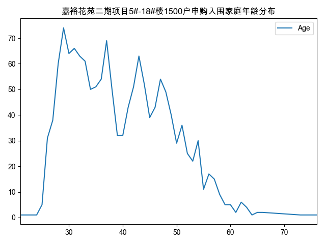

# python 可视化学习,简单数据分析

## 使用pandas对嘉裕花苑二期项目5#-18#楼1500户申购入围家庭所在乡镇进行简单数据分析

-- 数据来源 德化网 https://www.dehua.net/mobile/publicity/show-302309.shtml


### 分析结果

# 1.申购所在乡镇分布图

对数据进行简单分析：

申购人数最多的乡镇是水口，水口、雷锋、龙门滩、上涌这几个乡镇申请人数占40%以上。申购的人主要是德化户籍的占了
99%，非德化户籍的仅3个分别是永泰2人，四川1人。
其中三班做为人口数量较多的乡镇申购人数较少，可能一个重要原因是三班陶瓷业比较发达，在本地安家立业的较多，不需要像其他乡镇的人到县城谋生。


龙门滩申购人员分布


葛坑申购人员分布


# 2.申购人员年龄分布

申购最多的年龄段分布在30-35年龄段，最大申购的年龄是76岁。





开发环境

系统：MacOS Mojave

Python3.6 + Conda


代码地址：
``` 
https://github.com/fredliu168/HouseBuyDehua
```


激活环境
```
 source activate houseBuyDehua 
```

安装matplotlib
```
pip install pandas
pip install matplotlib
```

解决MAC OS中文字体显示问题
```
plt.rcParams['font.sans-serif'] = ['Arial Unicode MS']  # for Chinese characters

```

